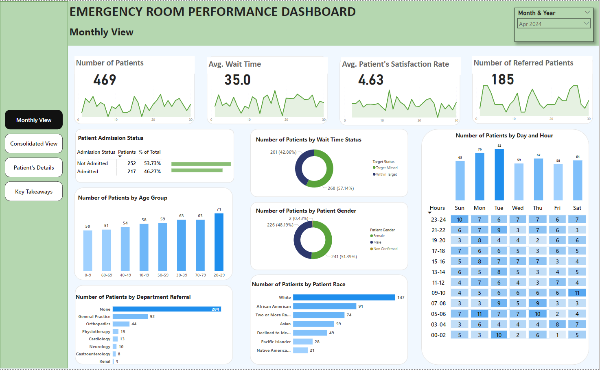
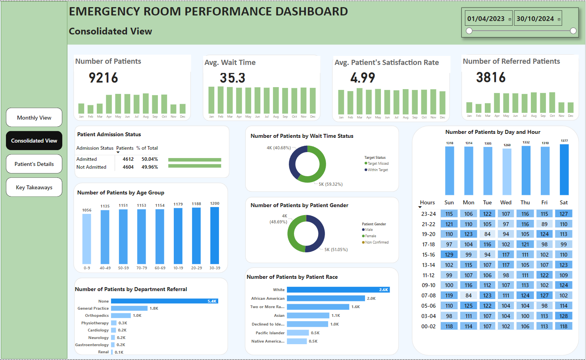
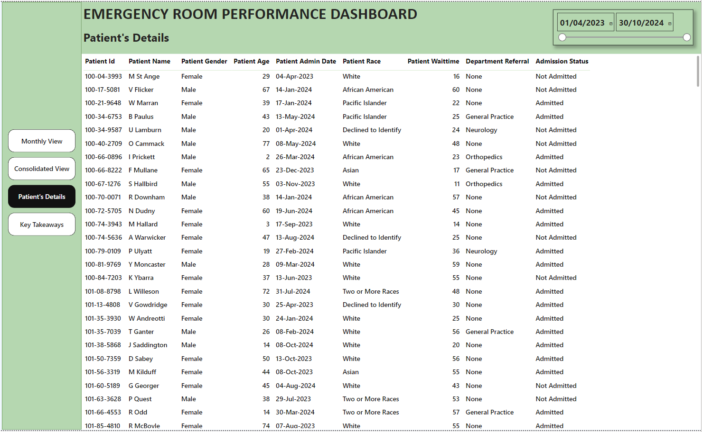
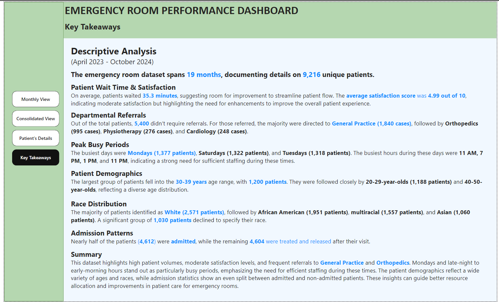

# Emergency Room Performance Dashboard

## Table of Contents

1. [Overview](#overview)
2. [Project Objectives](#project-objectives)
3. [Datasets Used](#datasets-used)
4. [Key Performance Indicators (KPIs)](#key-performance-indicators-kpis)
5. [Dashboard Views](#dashboard-views)
   - [Monthly View](#1-monthly-view)
   - [Consolidated View](#2-consolidated-view)
   - [Patient Details](#3-patient-details)
   - [Key Takeaways](#4-key-takeaways)
6. [Implementation Steps](#implementation-steps)
7. [Insights and Recommendations](#insights-and-recommendations)
8. [About the Author](#about-the-author)
9. [License](#license)

---

## Overview

The **Emergency Room Performance Dashboard** provides a comprehensive analysis of patient flow, satisfaction, and resource allocation in hospital emergency rooms. By leveraging data visualization in Power BI, this project enables hospital administrators and stakeholders to make data-driven decisions to optimize emergency room operations.

---

## Project Objectives

The goal of this project is to:

- Evaluate emergency room performance through key metrics like patient wait time, satisfaction rates, and referrals.
- Identify peak periods and resource bottlenecks.
- Provide actionable insights to improve patient care and hospital efficiency.

---

## Datasets Used

1. **Hospital_1_Cleaned_Data.xlsx**:
   - Contains patient-level data, including demographics, wait times, admission status, and department referrals.

2. **Date_Table_Cleaned_Data.xlsx**:
   - Includes a comprehensive date table for time-based analysis and custom date filtering.

---

## Key Performance Indicators (KPIs)

1. **Number of Patients**:
   - Tracks the total number of patients visiting the ER.
2. **Average Wait Time**:
   - Measures the average time patients wait before being attended to.
3. **Patient Satisfaction Rate**:
   - Analyzes patient feedback on their experience.
4. **Number of Referred Patients**:
   - Monitors the count of patients referred to various departments.
5. **Admission Status**:
   - Tracks the percentage of admitted versus non-admitted patients.

---

## Dashboard Views

### **1. Monthly View**

The Monthly View highlights key metrics such as patient count, wait times, and satisfaction scores across days of a month.

**Key Features:**
- Admission status: Admitted vs. non-admitted patients.
- Demographic breakdown by age, gender, and race.
- Time analysis: Patient volume by hour and day.

---

### **2. Consolidated View**

The Consolidated View aggregates metrics over a selected time range, providing a high-level overview of hospital performance.

**Key Features:**
- Time-based trends in patient count, wait times, and satisfaction rates.
- Detailed breakdown of department referrals and admission status.

---

### **3. Patient Details**

This view provides granular insights into individual patient records for detailed analysis and troubleshooting.

**Key Features:**
- Patient demographics: Age, gender, and race.
- Admission details: Wait times, department referrals, and satisfaction scores.
- Drill-through capability for deeper analysis.

---

### **4. Key Takeaways**

This section summarizes the dashboard’s insights to provide stakeholders with actionable recommendations.

**Key Features:**
- Descriptive analysis of patient trends, peak periods, and satisfaction rates.
- Recommendations for operational improvements.

---

## Implementation Steps

1. **Data Cleaning**:
   - Address missing values and inconsistencies in patient data.
   - Prepare a date table for accurate time-based analysis.

2. **Data Modeling**:
   - Establish relationships between the patient data and date table in Power BI.
   - Create calculated columns and measures using DAX for advanced analysis.

3. **Dashboard Development**:
   - Design user-friendly visuals and implement filters for interactive analysis.
   - Ensure dashboards are optimized for performance and accessibility.

4. **Validation and Testing**:
   - Validate metrics against raw data to ensure accuracy.
   - Test the dashboard with different time ranges and filters.

---

## Insights and Recommendations

### **Key Insights**
1. **Patient Trends**:
   - Peak patient volumes occur on Mondays and Saturdays, with high activity during late-night hours.
2. **Satisfaction Rates**:
   - Average patient satisfaction is 4.99/10, indicating room for improvement.
3. **Department Referrals**:
   - General Practice and Orthopedics receive the highest number of referrals, highlighting the need for additional resources in these departments.
4. **Demographics**:
   - Patients aged 30-39 make up the largest age group, while white patients form the majority demographic.

### **Recommendations**
1. **Operational Efficiency**:
   - Allocate additional staff during peak hours (11 AM, 7 PM) and on Mondays to reduce wait times.
2. **Resource Allocation**:
   - Enhance support for General Practice and Orthopedics to handle high referral volumes.
3. **Patient Experience**:
   - Conduct further analysis on satisfaction scores to identify areas for improvement.

---

## About the Author

**Ebru Kara** is a skilled data analyst with expertise in SQL, Python, and Power BI. Passionate about leveraging data for impactful decision-making, Ebru is dedicated to solving complex problems through insightful analysis and visualization.

---

## License

This project is licensed under the MIT License. See the `LICENSE` file for more details.

